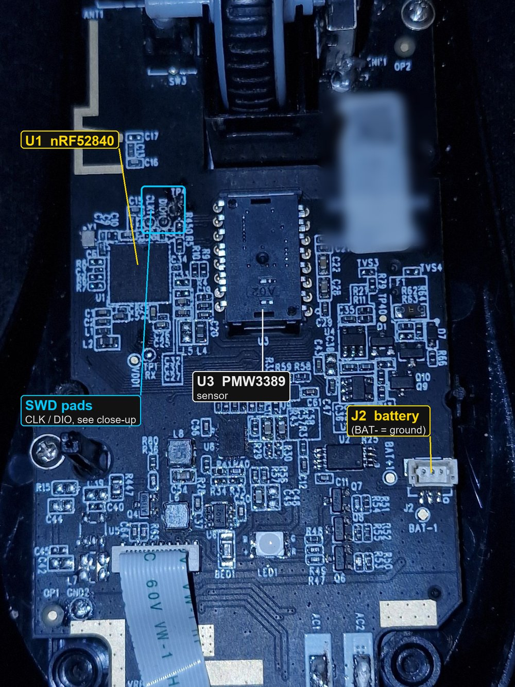
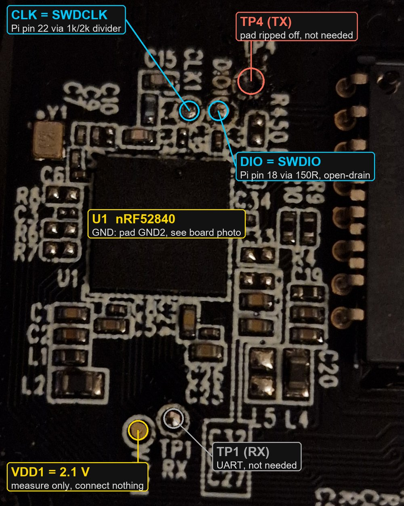

# Pulsedart: open firmware for the HyperX Pulsefire Dart

A replacement firmware for the **HyperX Pulsefire Dart** wireless mouse (nRF52840 + PixArt
PMW3389), written from scratch on Zephyr / nRF Connect SDK. It keeps what the stock firmware
offers and adds Bluetooth LE.

<table>
<tr>
<td></td>
<td></td>
</tr>
<tr>
<td>My Dart opened up. The SWD pads are next to the nRF52840 (U1), ground on GND2.</td>
<td>Close-up of the pads. The TX pad came off while I was soldering; it is not needed.</td>
</tr>
</table>

Why: I rarely play games and wanted to use this mouse over Bluetooth, without the dongle.
The Dart already has an nRF52840 inside, which does Bluetooth fine; the stock firmware just
never used it. So I dumped the stock firmware over SWD with a Raspberry Pi, worked out how
everything is wired and talks to the dongle and NGENUITY, and wrote my own firmware that does
everything the stock one does, plus BLE.

What works:

- **USB** wired mouse with the stock USB identity (0951:16E2, 4 HID interfaces).
- **2.4 GHz with the stock HyperX dongle** (Nordic ESB). The protocol was reverse engineered;
  the unmodified stock dongle works.
- **Bluetooth LE** HID mouse (HOGP) with battery level. The stock Dart has no Bluetooth.
- **NGENUITY** (HyperX configuration software) works over USB and over the dongle: lighting,
  DPI, polling rate, button remapping, macros, all saved to the mouse's EEPROM.
- Stock lighting engine, DPI stages, button map, macros, charging and battery indications.
- Stock-like sleep: radio and LEDs off after about 10 s idle; a motion, button or wheel
  interrupt wakes the mouse in a few milliseconds.
- Optional **MCUboot** variant: signed firmware updates over the USB cable (no more opening
  the mouse), plus a recovery mode (hold Left + Right + Back while switching on).

How often motion reaches the PC, measured on Windows 11 with
[tools/rawinterval.ps1](tools/rawinterval.ps1) while moving the mouse in circles:

| Link | Update interval | Notes |
|---|---|---|
| USB cable | **1 ms** (1000 Hz) | median gap 1.00 ms |
| Bluetooth LE | **~7.5 ms** | the BLE connection interval; each interval carries a few reports |
| Stock dongle (2.4 GHz) | **8 ms** (125 Hz) | the firmware sends every 1 ms, but reports arrive at 125 Hz through my (HP) dongle; the limit seems to be on the dongle's USB side, not investigated yet |

Waking up from sleep takes 2-7 ms until the first packet reaches the dongle. These numbers
are the report rate, not a full click-to-screen latency measurement.

> **Status:** personal project, running daily on my own mouse (mostly over Bluetooth). Tested
> on hardware, see [docs/testing.md](docs/testing.md). Not affiliated with HyperX, HP or
> Kingston. You need an SWD programmer and must open the mouse. You can brick nothing
> permanently as long as you keep your own full flash dump (the flash is not
> read-protected), but you do this **at your own risk**.


The back of the stock dongle with its SWD pads (only needed if you want to look inside it).
How I wired the Raspberry Pi as the programmer: [header diagram](docs/img/pi_header_wiring.png),
details in [docs/hardware.md](docs/hardware.md).

## Documentation

| Document | What is in it |
|---|---|
| [docs/hardware.md](docs/hardware.md) | Opening the mouse, SWD pads, wiring a Raspberry Pi as programmer (2.1 V target!), pin map |
| [docs/flashing.md](docs/flashing.md) | Dumping the stock firmware, building, flashing, logs, restoring stock |
| [docs/firmware.md](docs/firmware.md) | What the firmware does: modes, controls, LEDs, sleep, NGENUITY, BLE, memory map |
| [docs/testing.md](docs/testing.md) | What was verified on hardware and how; measurements |
| [docs/reverse-engineering.md](docs/reverse-engineering.md) | Index of the reverse-engineering notes in `re/` (mouse, dongle, protocols) |
| [docs/publishing.md](docs/publishing.md) | What must never go into the public repository, and why |
| [re/fw_debug.md](re/fw_debug.md) | SWD-only debug hooks (synthetic motion, mode switch, current log) |
| [CHANGELOG.md](CHANGELOG.md) | Releases and planned work |

## Repository layout

```
fw/boards/hyperx/pulsedart/   Zephyr board definition (pins, partitions)
fw/mouse/                     the firmware (src/, prj.conf, MCUboot variant in mcuboot/)
fw/mcuboot_hooks/             MCUboot hooks (recovery button combo, LEDs, watchdog)
fw/app/                       stage-1 bring-up test (LEDs + buttons over RTT)
fw/build.ps1                  build helper (Windows, nRF Connect SDK v3.4.1)
fw/build-mcuboot.ps1          same for the MCUboot variant (-Debug adds a USB log port)
pi/                           OpenOCD configs and scripts for the Raspberry Pi programmer
re/                           reverse-engineering notes of the stock mouse and dongle firmware
tools/extract_blobs.py        builds the two stock-derived headers from YOUR flash dump
PINMAP.md                     nRF52840 pin map of the mouse
```

## Quick start

1. Wire an SWD programmer ([docs/hardware.md](docs/hardware.md)). The target runs at **2.1 V**.
2. Dump the complete stock flash, UICR and EEPROM and keep them safe
   ([docs/flashing.md](docs/flashing.md#dump-the-stock-firmware)).
3. `python tools/extract_blobs.py dump/flash.bin` (sensor SROM and LED tables from your dump).
4. `fw\build.ps1 mouse`, then flash `zephyr.hex` with `pi/flash_mouse.sh`.

The stock boot stub and the HyperX USB bootloader below 0x50000 are never touched by the
normal build. `pi/restore_stock.sh` restores the stock application from your dump.

With the MCUboot variant you flash once over SWD (`fw\build-mcuboot.ps1`,
`pi/flash_mcuboot.sh`) and update over USB afterwards (`pi/dfu_update.sh`). Generate your own
signing key first, see [docs/flashing.md](docs/flashing.md#mcuboot-variant-firmware-updates-over-usb-in-use-since-2026-09-28).

## Disclaimer

This is an unofficial hobby project. It is not affiliated with, endorsed or supported by
HyperX, HP, Kingston or PixArt.

Opening the mouse, soldering to it and replacing its firmware voids your warranty and can
damage the mouse, its battery or the computer it is connected to. Everything here is provided
as is, without any warranty. You do all of this **at your own risk**; the author takes no
responsibility for any damage, data loss or other consequences. Keep a full dump of your stock
firmware before you flash anything.

## License

[MIT](LICENSE) for our own code and documentation. This does not cover:
- Zephyr (Apache-2.0) and nRF Connect SDK (LicenseRef-Nordic-5-Clause), which are used as
  dependencies;
- the stock-derived data (PixArt SROM, HyperX LED tables). It is not in the repository and is
  generated from your own dump.

HyperX and Pulsefire are trademarks of HP Inc. This project is not affiliated with HP,
HyperX, Kingston or PixArt.
