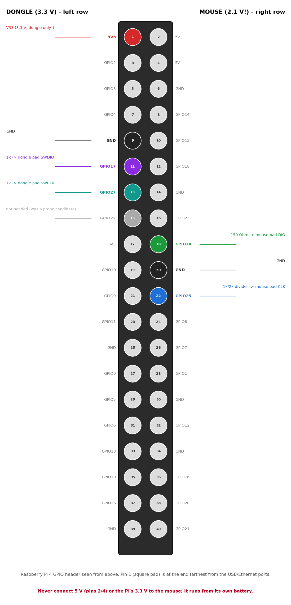
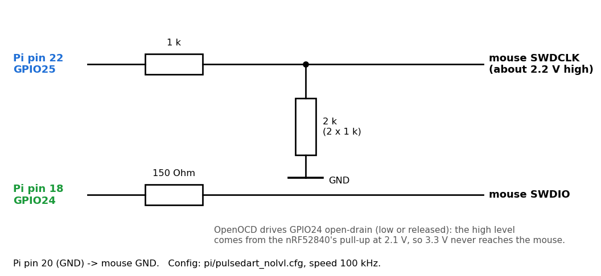
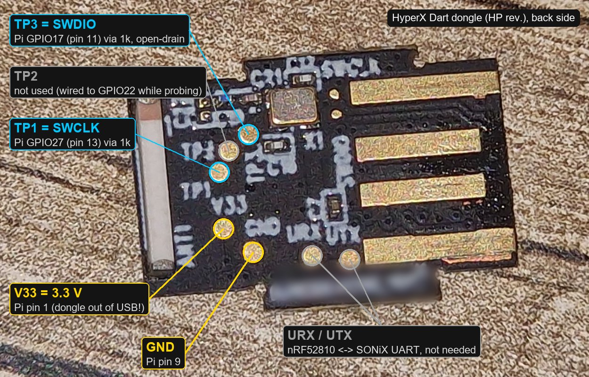

# Hardware: mouse, dongle and the programmer

## The mouse

| Part | Details |
|---|---|
| MCU | Nordic **nRF52840 QIAAD0** (rev 2), 1 MB flash, 256 KB RAM |
| Supply | battery → VDDH, REG0 set to **2.1 V** (UICR REGOUT0 = 1), DC/DC on REG1. **All MCU I/O runs at 2.1 V.** |
| Sensor | PixArt **PMW3389** on SPI0 (mode 3, 2 MHz), needs its SROM uploaded at boot |
| EEPROM | I²C 0x50, about 64 KB, holds all user settings (stock layout, see `re/eeprom.md`) |
| Fuel gauge | TI **bq27421** at I²C 0x55 (800 mAh design capacity) |
| Clocks | no 32 kHz crystal (LFCLK = RC) |
| Debug | SWD, **APPROTECT open** on the author's unit (stock firmware 1.1.0.8) |

The full pin map is in [../PINMAP.md](../PINMAP.md). Differences from that file, confirmed on
hardware on 2026-09-27:
- P1.04 is the front side button (stock map entry 3, "forward"), and P1.02 is the rear one.
- The scroll wheel direction is correct without inversion.
- P0.24 is high whenever the LEDs are driven.
- The charger pins are confirmed: P1.11 is 0 on external power, and P1.06 is 0 while charging.

## Programmer: Raspberry Pi 4 with OpenOCD (linuxgpiod bit-bang)

Any SWD probe works if it can drive a **2.1 V** target (J-Link, a CMSIS-DAP probe with a VTref
input, ...). The author used a Raspberry Pi 4 without a level shifter.

> **Warning:** never drive the mouse's SWDIO push-pull from a 3.3 V GPIO. Early in the
> project a push-pull probe put 3.3 V on the 2.1 V SWDIO for a few seconds. The chip
> survived, but do not repeat it. All configs here use SWDIO open-drain.

Wiring (config `pi/pulsedart_nolvl.cfg`; diagrams generated by `tools/gen_wiring.py`):





```
Pi GPIO25 (pin 22) --[1k]--+-- mouse SWDCLK      divider 1k / 2k -> about 2.2 V high level
                           [2k] (two 1k in series)
                           GND
Pi GPIO24 (pin 18) --[150R]--- mouse SWDIO       open-drain: the Pi only pulls low,
                                                 the high level comes from the nRF pull-up
Pi pin 20 (GND) ---------------- mouse GND
```

- Adapter speed: 100 kHz (the open-drain rising edge is slow).
- `reset_config none`: reset is done over SWD (`reset run` / AIRCR), not with the reset pin.
- The Pi's own 3.3 V must not be connected to the mouse. The mouse runs from its battery.
- **Where to solder on the mouse PCB** (main board, top side, around the nRF52840 marked "U1"
  and "N52840"; the silkscreen labels are printed next to round test pads):
  - **CLK** (SWDCLK) and **DIO** (SWDIO) are the two pads to the right of U1, towards the
    PCB antenna. They take the programmer wires.
  - **VDD1**, left of U1, is the 2.1 V MCU supply. It is only for measuring; connect nothing.
  - **TP1 "RX"** and **TP4 "TX"** are the UART (not needed; the stock firmware does not use it).
  - GND: any ground point, e.g. the battery negative (BAT−) or a connector shield.
  - Board photos: the public FCC filing of the mouse, [FCC ID JIC-MC006B](https://fccid.io/JIC-MC006B)
    (internal photos exhibit). A photo of our own with the pads marked is still to be added (TODO).

Check the wiring read-only first: `pi/step1.sh` reads the IDCODE and FICR and checks APPROTECT
without writing anything.

## The stock dongle (optional, only needed for dongle reverse engineering)

The spare dongle used here enumerates as **03F0:068E "HyperX Pulsefire Dart"** (HP era). The
author's mouse uses it through `CONFIG_PULSEDART_ESB_RECORD` in `fw/mouse/local.conf` (its
address `4a 91 3c d7`, see [firmware.md](firmware.md#24-ghz-dongle-esb)). A mouse with its own
original dongle needs nothing: the firmware uses the stock pairing record.

| Part | Details |
|---|---|
| Radio | Nordic **nRF52810 QCAAD0** (ESB PRX), 3.3 V, APPROTECT open |
| USB | SONiX **SN32F264** (Cortex-M0), talks to the nRF over SPI (not dumped) |

Programming the dongle is not needed for this firmware. On my dongle (HP revision, USB VID
03F0) the round pads on the back are only labelled **TP1 / TP2 / TP3**, **V33**, **GND** and
**URX / UTX**; SWD is on two of the test points:



For reading it (`pi/dongle_ok.cfg`, left header row in the diagram above):
- **TP1 = SWCLK:** GPIO27 (pin 13) through 1 kΩ.
- **TP3 = SWDIO:** GPIO17 (pin 11) through 1 kΩ. OpenOCD drives it open-drain.
- **V33:** Pi pin 1 (3.3 V), **GND** on pin 9. Unlike the mouse, the dongle is powered from the
  Pi, so take it out of the USB port first.
- TP2 is not SWD. I had it on GPIO22 while probing; it is not used.
- URX/UTX (the UART between the nRF and the SONiX) are not needed.

I soldered all three TPs and tried every CLK/DIO combination; only CLK on TP1 with DIO on TP3
answered (DPIDR 0x2ba01477). `pi/dongle_guard.tcl` refuses to run if it finds
the 2.1 V mouse on the wires instead. Other revisions may differ; FCC photos:
[JIC-MCWA1](https://fccid.io/JIC-MCWA1) (Kingston) and [B94-MCWA1](https://fccid.io/B94-MCWA1) (HP).
